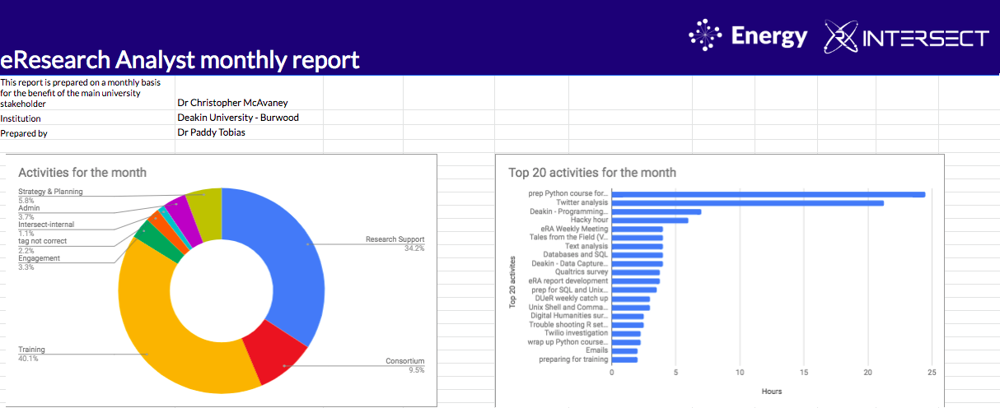

# eRA monthly report builder

A program written in R to create monthly reports of eResearch Analyst activities for the benefit of reporting to members. 

## Standard execution
Standard execution: `Rscript era_report.R MM YYYY era@intersect.org.au`. The third argument is optional for when you want to run the script for just one person. 

The program will create a report based on your calendar events for a specific month. You can give it the month and/or year to report on (e.g., `Rscript era_report.R 07 2018`) or you can use the default (`Rscript eRA_report.R`), which will produce you a report for the month previous from when you run the script.




## Using your calendar
Please read the advice on using your calendar before doing anything else: [calendar_advice](https://github.com/paddytobias/era_report/blob/master/calendar_advice.md)

## Want to be a part of this?
For all other variables (e.g., your name, institution, etc), the program goes off an authority file on Intershare. Please make sure you have updated your details [there](https://docs.google.com/spreadsheets/d/1G2YadcphdT1xkf6VJLiF-zvaLYd3a113avNJCMsB930/edit?usp=sharing).

## Configuration
If you are going to be the designated "report runner", there's a few things you'll need to do to get set up. 

* Clone this repository
* Create a file in the same directory as the program and call it `config.R`. 
* Add the following variables to it:
```
# Configurations

## FOR GOOGLE API CREDENTIALS
client_id = XXXX
client_secret = XXXX
```
* The `client_id` and `client_secret` are the credentials you need to get from creating a "project" on [console.developers.google.com](console.developers.google.com). For information on how to set this up, go [here](README_1.0.md#config-file). 
* Finally ensure you have added anyone needing a report to your Google Calendar, so they are visible to you. 

## Running the report builder each month
* Navigate to the directory hold the program in the terminal
* Run `rm .httr-oauth` to delete the old credentials - this step is due to a current issue with the `googlecalendars` R package not storing the credentials properly. 
* Then run the [standard execution](#standard-execution) for the `era_report.R` script.
* You will have to authorise the API calls a few times during the first iteration of the program. This is done by clicking on the url links that are generated in the terminal. (Recommend using iTerm so that you can right-click on these links and open them in your browser)

## History of the program
2.0 now does this for all eRAs and adds the monthly events to a running datasheet that can be used for MVR quarterly and annual reports. 1.0 was designed to only run for one eRA at a time. 

Both 1.0 and 2.0 can be run the same way. 


---

## Trouble shooting
* Getting ```Error in httpuv::startServer(use$host, use$port, list(call = listen)) : 
Failed to create server``` - this most likely means that you have a zombie port that's open. The Google API relies on talking to port 1410. To kill this zombie port: run `sudo lsof -i :1410` to see which port is open, then run `kill $(lsof -t -i :1410)` to kill it. 
